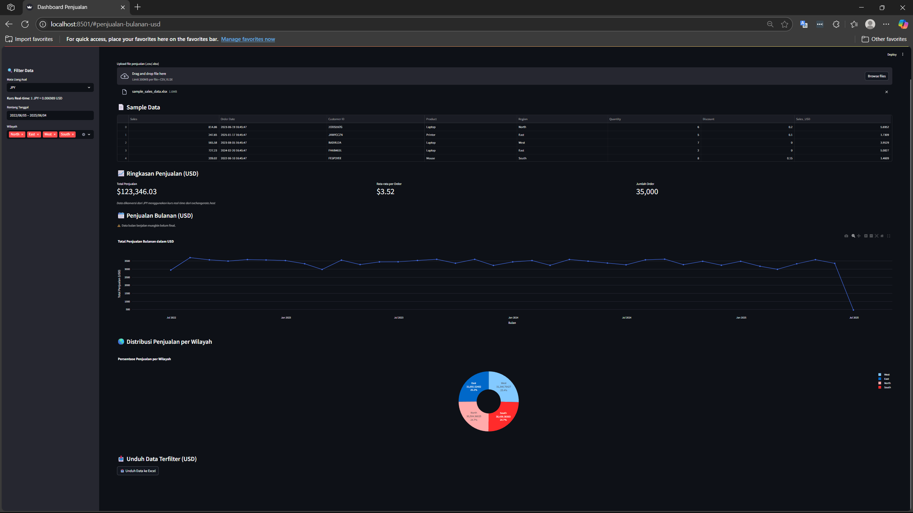

# 📊 Dashboard Penjualan Interaktif untuk Toko & Bisnis Kecil

Dashboard ini membantu Anda **mengevaluasi performa penjualan** dengan mudah hanya dari file Excel atau CSV. Dirancang untuk pemilik usaha, analis penjualan, dan freelancer yang butuh alat visualisasi cepat dan intuitif.



---

## 🎯 Fitur Utama

✅ **Upload File Otomatis**

- Format: `.xlsx`, `.csv`
- Otomatis mendeteksi encoding (termasuk file bermasalah)

✅ **Filter Dinamis**

- Rentang tanggal
- Kategori produk (jika ada)
- Wilayah atau region (jika tersedia)

✅ **Statistik Ringkasan Otomatis**

- Total Penjualan
- Rata-rata per Order
- Jumlah Order

✅ **Visualisasi Interaktif**

- Grafik Penjualan Harian / Bulanan
- Grafik Bar per Kategori Produk
- Pie Chart per Wilayah

✅ **Ekspor Hasil Analisis ke Excel**

- Hanya data yang sudah difilter yang akan diunduh
- Praktis untuk laporan atau presentasi

---

## 🛠️ Teknologi yang Digunakan

- Python
- Streamlit
- Pandas
- Plotly Express
- XlsxWriter
- Chardet

---

## 📁 Contoh File Penjualan (Format Excel/CSV)

| Order Date | Sales  | Category | Region |
| ---------- | ------ | -------- | ------ |
| 2023-06-01 | 150000 | Laptop   | East   |
| 2023-06-02 | 75000  | Printer  | West   |
| ...        | ...    | ...      | ...    |

> Kolom minimal yang dibutuhkan: `Order Date`, `Sales`

---

## 🚀 Cara Menjalankan di Lokal

```bash
# 1. Clone repository
git clone https://github.com/VoidK41/dashboard-penjualan

# 2. Masuk ke folder proyek
cd dashboard-penjualan

# 3. Instal dependensi
pip install -r requirements.txt

# 4. Jalankan aplikasi
streamlit run app.py
```

---


## 💼 Cocok Untuk

- UKM & toko yang ingin memonitor penjualan dengan mudah
- Freelancer yang butuh dashboard siap pakai untuk klien
- Konsultan penjualan dan laporan berkala tim marketing

---

## 🧑‍💻 Kontribusi & Lisensi

Silakan fork, gunakan, dan modifikasi!
Lisensi: **MIT** – bebas digunakan untuk keperluan pribadi maupun komersial.


## 👨‍💻 Author

**Khairu Ikramendra**  
Freelance dashboard developer & data analyst  
[LinkedIn](https://www.linkedin.com/in/khairuikramendra/) | [Upwork](https://www.upwork.com/freelancers/~017002e8546494c6e9)
